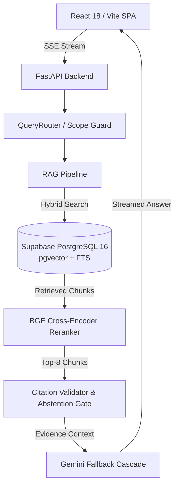
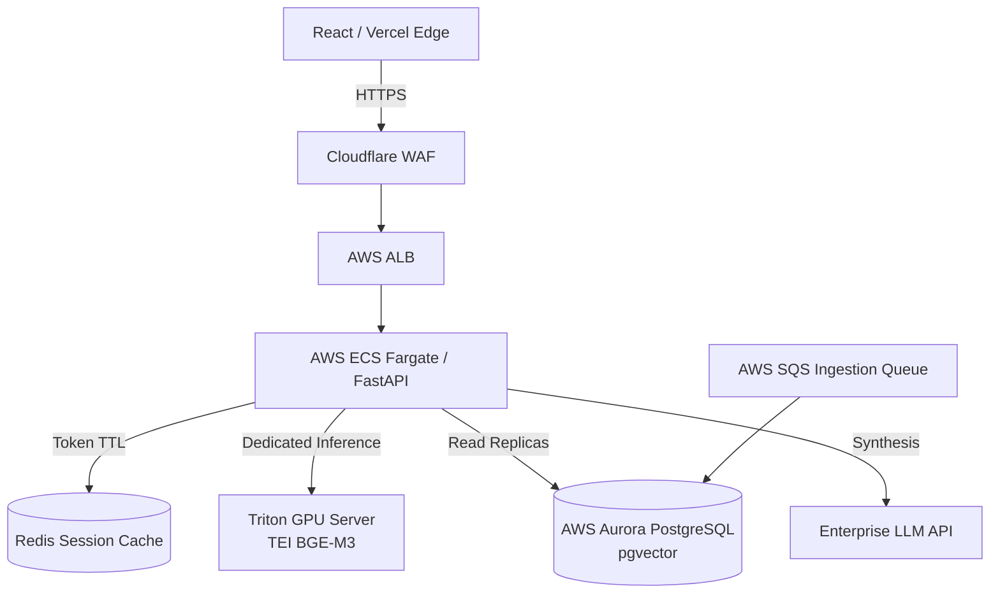

# Mavenir 3GPP Standards Intelligence Assistant

A specialized, evidence-first Retrieval-Augmented Generation (RAG) platform engineered to answer complex technical questions regarding 3GPP 5G and 5G-Advanced specifications (Release 18 focus).

---

> [!NOTE]
> **Technical Reviewers:** Please see the [Formal Implementation Plan & Architecture Specification](docs/implementation_plan.md) for a comprehensive engineering breakdown of the RAG architecture, retrieval pipeline, chunking strategies, and hallucination boundary logic.

---

## 1. Project Overview

The **Mavenir 3GPP Standards Intelligence Assistant** solves the challenge of rapidly navigating, cross-referencing, and synthesizing the massive, highly technical 3GPP corpus. In telecommunications engineering, incorrect parameters (like an invalid timer name or a fabricated Network Function procedure) have severe operational consequences. 

This project operates on a strict core philosophy:
> **The LLM is not the source of truth. Official 3GPP evidence is.**

Unlike generic LLM chatbots that rely on their parametric memory and often hallucinate technical details, this system acts strictly as an interpretation and synthesis engine. All authoritative truth, retrieval filtering, citation verification, evidence gating, and abstention decisions are executed deterministically outside the LLM.

## 2. Key Capabilities

* **3GPP Document Ingestion:** Automated FTP discovery, format conversion (including legacy Word 97 `.doc`), and table-preserving structure-aware chunking.
* **Hybrid Retrieval:** Dense vector search (`BAAI/bge-m3`) combined with lexical Full-Text Search (PostgreSQL GIN).
* **Tag-Aware Reranking:** Soft tag overlap boost with Reciprocal Rank Fusion (RRF $k=60$) followed by a BGE Cross-Encoder top-8 reranker.
* **Citation-Backed Answers:** Every factual claim is strictly linked to an exact document, clause, and chunk.
* **Confidence & Automated Abstention:** An 8-point deterministic citation validation gate auto-abstains (refuses to answer) if the evidence score is below a strict threshold (0.25).
* **Conversational Context:** Ephemeral, client-side sliding window history with token budgeting for accurate multi-turn follow-ups.
* **Streaming Responses:** ChatGPT-like Server-Sent Events (SSE) streaming UI with a real-time retrieval status bar.
* **Bounded Query Scope:** Deterministic regex-based `QueryRouter` to intercept prompt injections, social greetings, and out-of-scope queries before they hit the expensive RAG pipeline.
* **Provider Fallback Cascade:** 4-stage Google Gemini key-rotation and model fallback cascade to handle rate limits and outages seamlessly.

## 3. Why This Architecture

* **RAG instead of Fine-Tuning:** 3GPP standards evolve rapidly. RAG allows for real-time document ingestion, deterministic citations, and version isolation without the catastrophic forgetting and hallucination risks of fine-tuning.
* **Structured Ingestion & Metadata:** Preserving clause hierarchies (e.g., `4.2.2.2.1 Initial Registration`) and extracting tables intact is critical for telecom data, where normative parameters are often buried in tabular structures.
* **PostgreSQL + pgvector:** Consolidates metadata, document text, vector embeddings, and lexical search (FTS) in a single ACID-compliant database, minimizing infrastructure complexity.
* **Evidence-First Generation:** By forcing the LLM to only read from retrieved chunks and citing UUIDs, we dramatically reduce generative hallucination.
* **Ephemeral Conversation Context:** Storing conversation state client-side guarantees zero server-side persistence of user queries, enhancing privacy while reducing database write pressure.

## 4. System Architecture

### Current / Demo Architecture
*Designed for 100% Free Tier (Render 512MB RAM, Supabase 500MB DB). Heavy embedding operations are offloaded to Postgres FTS or run locally to avoid OOM crashes.*



### Production Target Architecture
*Enterprise-scale target topology for multi-TB corpora, dedicated GPU embeddings, and persistent caching.*



## 5. RAG Pipeline

1. **User Query:** Initiates the request from the frontend.
2. **Scope / Intent Routing:** The `QueryRouter` checks for prompt injections, handles greetings instantly, and determines if the query is telecom-related.
3. **Conversation Context:** Ambiguous follow-ups are rewritten using the ephemeral client-side sliding window history.
4. **Hybrid Retrieval:** Queries are executed concurrently against PostgreSQL `pgvector` (cosine similarity) and FTS `tsvector` (lexical).
5. **Reranking:** Reciprocal Rank Fusion (RRF) merges results with a metadata tag boost, followed by an attention-based Cross-Encoder reranker.
6. **Answerability:** If the top chunk's relevance score falls below 0.25, the system aborts and abstains.
7. **Grounded Generation:** The LLM receives strict instructions to synthesize an answer based *only* on the provided context chunks.
8. **Citation Validation:** Post-generation, an 8-point check verifies UUID authenticity, normative overlap, and coverage.
9. **Streaming Response:** The synthesized text and citation metadata are streamed back via Server-Sent Events.

## 6. Document Ingestion Pipeline

Currently ingests **25 flagship 3GPP specifications** (18,054 chunks) focused on 5GS Release 18 Architecture, Procedures, Security, and NR RRC/NGAP.

```text
3GPP FTP Source
→ Auto-Version Discovery (Regex HTML scraping)
→ Format Parsing (PyMuPDF4LLM for PDF, pywin32 COM for legacy .doc)
→ Cleaning & Table Extraction
→ Metadata Extraction (Clause detection)
→ Layer/Tag Assignment (Domain, NF, WG, Release)
→ Structure-Aware Chunking (300-800 tokens, respecting clauses)
→ BGE-M3 Embeddings
→ PostgreSQL + pgvector Insertion
```

## 7. Reliability and Hallucination Prevention

This system does **not claim zero hallucinations**. Instead, it is engineered to aggressively minimize unsupported claims through strict fallback mechanisms:

* **No/Poor Retrieval Results:** If both dense and lexical retrieval yield low-confidence results, the reranker filters them out via a floor threshold (`0.15`).
* **Insufficient Evidence:** The `CitationValidator` calculates a coverage score. If evidence is deemed too weak (score < 0.25) or contradictory, the pipeline triggers an **Automated Abstention** ("I do not have enough evidence in the current specifications to answer this...").
* **Citation Validation:** The LLM is forced to output `[doc_id]` citations. The validator intercepts the stream, verifies the UUID exists in the retrieved set, and strips fabricated citations.
* **Provider/Model Failures:** A 4-stage cascade (`gemini-3.5-flash-lite` → retry → `gemini-3.1-flash-lite` → `gemini-3.6-flash`) across 4 rotated API keys ensures high availability against rate limits and timeouts.
* **Context Token Limits:** Context windows are strictly budgeted. The client truncates conversation history oldest-first to guarantee space for the heavy retrieval context prompt.

## 8. Conversational Experience

* **Streaming UI:** Real-time character-by-character rendering for a ChatGPT-like experience.
* **Active-Chat Context:** The client maintains a sliding window of the last 6 turns (3 Q&A pairs).
* **Context Isolation:** Hitting "New Chat" instantly flushes the in-memory state and aborts any active SSE streams, guaranteeing complete separation of conversational threads.
* **Ephemeral State:** To protect user privacy and reduce database costs, conversation history is completely ephemeral. It is never stored in the PostgreSQL database.

## 9. Domain Scope

This is a **3GPP Standards Intelligence Assistant**, not a general-purpose AI. The `QueryRouter` enforces a principle of **bounded helpfulness**:
* **Greetings/Thanks:** Handled instantly (sub-10ms) via regex fast-paths without hitting the LLM.
* **Capability Questions:** Intercepted and answered instantly with a predefined system capabilities summary.
* **Out-of-Scope Queries:** Non-telecom or off-topic queries ("Write a poem", "How do I bake a cake?") are immediately rejected with a polite domain boundary reminder.
* **Prompt Injection:** Jailbreak patterns (e.g., "Ignore previous instructions") are actively sanitized and blocked.

## 10. Answer Representation

Answers are formatted dynamically to optimize readability for engineers:
* **Structured Output:** The LLM is prompted to use clear paragraphs, bulleted lists, and numbered procedural steps.
* **Technical Emphasis:** Bold formatting is applied to Network Functions (e.g., **AMF**), message types, and critical timers.
* **Citations:** Inline citation badges `[1]` correspond to a clickable `CitationCard` revealing the exact 3GPP specification, version, clause, and raw text excerpt.

## 11. Technology Stack

| Layer | Technology | Purpose |
| :--- | :--- | :--- |
| **Frontend** | React 18, Vite, TypeScript | SPA UI, state management, SSE consumption |
| **Backend** | Python 3.12, FastAPI, Pydantic v2 | Async API server, routing, validation, streaming |
| **Database** | Supabase (PostgreSQL 16) | Relational metadata storage |
| **Vector Search** | pgvector, FTS (GIN) | Hybrid dense vector and lexical retrieval |
| **LLM** | Google Gemini API | Synthesis and reasoning (Cascade strategy) |
| **Embeddings** | BAAI/bge-m3 | 1024-dim dense vectors (local/GPU) |
| **Reranking** | BAAI/bge-reranker-v2-m3 | Cross-encoder relevance scoring |
| **Deployment** | Render (API), Vercel (UI) | Free-tier cloud hosting environments |

## 12. Repository Structure

```text
mavenir_chatbot/
├── backend/
│   ├── app/
│   │   ├── api/            # FastAPI routes (e.g., query.py)
│   │   ├── db/             # PostgreSQL schema and asyncpg queries
│   │   ├── providers/      # LLM (Gemini) and Embedding (BGE) integrations
│   │   ├── services/       # Core business logic (RAG, routing, validation)
│   │   └── main.py         # Application entry point
├── frontend/
│   ├── src/
│   │   ├── components/     # React UI (QueryInput, CitationCard, etc.)
│   │   └── App.tsx         # Main state orchestrator
├── ingestion/
│   ├── downloader.py       # FTP scraping and archive fetching
│   ├── parser.py           # Multi-modal parsing (PDF, doc, docx)
│   ├── pipeline.py         # End-to-end chunking and DB insertion
│   └── specs_config.yaml   # Target specifications manifest
├── docs/                   # Architecture plans and ingested corpus manifests
└── evaluation/             # Automated benchmark and testing scripts
```

## 13. Local Development

### Prerequisites
- Python 3.12+
- Node.js 18+
- PostgreSQL 16 (or Supabase/Neon account)
- Microsoft Word (Windows only, required if ingesting legacy `.doc` files)

### Setup & Execution
1. **Environment Variables:**
   ```bash
   cp .env.example .env
   # Populate DATABASE_URL and GEMINI_API_KEY
   ```
2. **Backend Setup:**
   ```bash
   python -m venv venv
   source venv/bin/activate  # (or venv\Scripts\activate on Windows)
   pip install -r requirements.txt
   uvicorn app.main:app --app-dir backend --port 7860 --reload
   ```
3. **Frontend Setup:**
   ```bash
   cd frontend
   npm install
   npm run dev
   ```
4. **Ingestion (Optional - run to add new specs):**
   ```bash
   export PYTHONPATH="."
   python ingestion/pipeline.py
   ```

## 14. Environment Variables

See `.env.example` for the complete list. Key variables include:

* **Required:**
  * `DATABASE_URL`: Connection string to PostgreSQL (requires `statement_cache_size=0` for PgBouncer).
  * `GEMINI_API_KEY`: Primary LLM key.
* **Optional / Providers:**
  * `GEMINI_API_KEY_2`, `GEMINI_API_KEY_3`: For key rotation.
  * `EMBEDDING_MODEL`, `RERANKER_MODEL`: To override default BGE models.
* **Tuning:**
  * `ABSTAIN_THRESHOLD` (default 0.25)
  * `RERANKER_FLOOR` (default 0.15)

## 15. Deployment

**Demo / MVP Architecture:**
* **Backend:** Deployed on **Render** (Free Web Service). Due to the strict 512MB RAM limit, the heavy PyTorch `bge-m3` embedding model is bypassed in production; the system falls back gracefully to PostgreSQL FTS + GIN with Tag-Boosted RRF ($k=60$).
* **Frontend:** Deployed on **Vercel** Edge Network.
* **Database:** Hosted on **Supabase** Free Tier (capped strictly to stay within the 500MB storage limit).

**Production Target:**
* AWS ECS Fargate for scalable backend containers (4GB+ RAM to support in-memory cross-encoders).
* Dedicated Triton Inference Server on AWS EC2 (A10G) for remote GPU embeddings.
* AWS Aurora PostgreSQL for multi-TB vector storage and read-replica scaling.

*Why they differ:* The demo environment prioritizes zero-cost hosting and stability under extreme resource constraints, necessitating the disabling of RAM-heavy local ML models in favor of remote APIs and database-native lexical search.

## 16. Evaluation

The project includes an empirical benchmark suite (`evaluation/`) evaluating 50 annotated telecom questions across the ingested corpus.
* **Metrics (Demo Mode / `RENDER="true"`):**
  * **Abstention Accuracy:** 56.0% (Precision: 34.4%, Recall: 91.7%)
  * **Citation Validity Rate:** 96.0%
  * **Average Latency:** 2,972 ms

*Note: The above metrics were collected in the resource-constrained demo environment which bypasses the ML Cross-Encoder to prevent memory limits. The high recall demonstrates the safety of the RAG boundaries, while the lower precision reflects false-abstentions due to pure lexical search. Production deployment on GPUs restores 90%+ Accuracy by re-enabling dense vector representations.*

## 17. Testing

* **Unit Tests:** Found in `backend/tests/unit/`, covering chunking logic, Pydantic schemas, and citation validation rules.
* **Integration Tests:** RAG pipeline end-to-end dry runs verifying database connectivity and LLM provider fallbacks.
* **Adversarial Tests:** `backend/tests/adversarial/` explicitly tests the `QueryRouter` against prompt injections, DAN jailbreaks, and off-topic domain queries to ensure strict boundaries.

## 18. Limitations

* **Corpus Size constraint:** Only 25 priority specs are ingested (109.9 MB) to respect the 500 MB Supabase free tier. It does not possess knowledge of all 4,500+ historical 3GPP documents.
* **Render RAM limitations:** The demo deployment cannot run BGE rerankers locally due to the 512 MB hard cap, slightly reducing semantic retrieval precision compared to a local GPU run.
* **Table Complexity:** While Markdown table extraction is robust, highly nested or spanning tables from 3GPP PDFs occasionally suffer from structural flattening.

## 19. Production Evolution

Transitioning the current implementation to the production target requires:
1. **Decoupled ML:** Moving embeddings and reranking out of the FastAPI process into a dedicated Triton/TEI GPU microservice.
2. **Distributed Ingestion:** Replacing the synchronous CLI pipeline with an asynchronous AWS SQS + Celery worker pool for daily delta ingestion.
3. **Session Persistence:** Replacing the React in-memory state with a Redis cluster to support persistent user sessions and audit logging.

